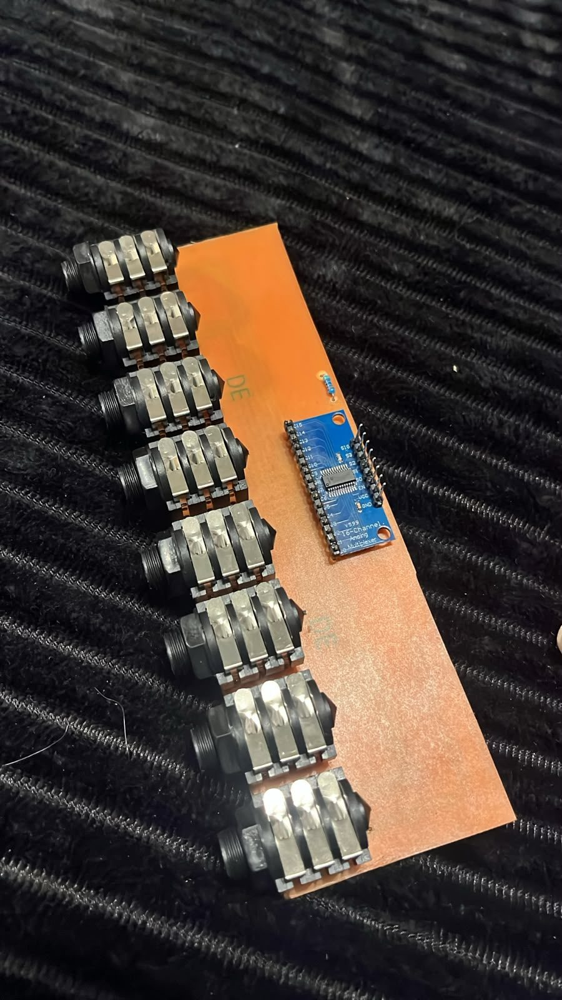
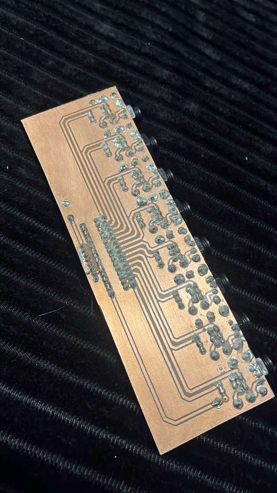

# Hardware

**Esquemático visual**: [docs/assets/esquematico-hellodrum.html](assets/esquematico-hellodrum.html)
(abrir no navegador) reúne todo o pinout abaixo num diagrama único — ESP32-S3
↔ 2x CD4067 (HW-178) ↔ tela TFT ↔ 1 encoder, já mostrando de qual header
físico (esquerdo/direito) cada fio sai. Também publicado como
[artifact](https://claude.ai/code/artifact/7bcaa18b-a9b3-46e4-8ba0-90197b7ededc)
(link privado, pode estar desatualizado - o arquivo local é a fonte da
verdade). Gerado em 2026-08-20, redesenhado em 2026-08-21 para o CD4067
(Fase K), reorganizado por ergonomia de montagem em 2026-08-21 (Fase L),
refinado no mesmo dia pra usar pinos fisicamente **contíguos** dentro de
cada header, reduzido de 2 encoders pra 1 na Fase Y (2026-09-04) e
**reorganizado por função** (em vez de por alimentação) na Fase Z
(2026-09-05, ver seção "Divisão adotada" abaixo) — atualizar (ou marcar
como desatualizado) se o pinout abaixo mudar de novo.

## Componentes previstos

- 1x placa ESP32-S3 (dev board, 44 pinos em 2 headers de 22, USB-C nativo
  exposto). Pinout confirmado a partir de uma foto da placa real (vendedor
  "OceanLabz") em 2026-08-21 — ver seção "Pinout real da placa" abaixo.
  Módulo confirmado por Rodrigo na serigrafia em 2026-08-31: **ESP32-S3-N16R8**
  (16MB flash + 8MB PSRAM **octal**) — GPIO33-37 são internos (barramento
  da PSRAM) nessa variante, ver "Pinos evitados" abaixo.
  `firmware/platformio.ini` ajustado em 2026-08-31 (overrides de
  `board_build`/`board_upload` + `-D BOARD_HAS_PSRAM`) pra refletir o
  módulo real (16MB flash, PSRAM octal habilitada) — ver
  [01-decisoes-arquiteturais.md](01-decisoes-arquiteturais.md) pro
  detalhe. `pio run` confirmado com sucesso.
- 2x módulo multiplexador analógico CD4067 (breakout "HW-178", 16 canais
  cada → 32 canais totais). Comprado já montado em placa (resistores/
  desacoplamento inclusos) — substitui as 4x CD4051 previstas originalmente,
  ver [01-decisoes-arquiteturais.md](01-decisoes-arquiteturais.md) pro
  racional da troca (Fase K).
  **Realização física (2026-09-06, confirmado por Rodrigo)**: em vez do
  breakout HW-178 avulso, cada um dos 2 MUX vive numa placa própria — a
  **jackboard** (`hardware/jackboard/`, projeto KiCad): HC4067 onboard +
  8 jacks TRS 6.35mm (16 canais) + rede de proteção por canal. O sistema
  final usa **2 jackboards idênticas**, uma por MUX, pra fechar os 32
  canais. **Cada jack TRS leva 2 canais**: canal par (0-based: 0, 2, 4…) =
  **tip**, ímpar (1, 3, 5…) = **ring** — na numeração do ConfigTool, Pad 1
  = tip e Pad 2 = ring do Jack 1, e assim por diante (confirmado pelo
  Rodrigo em 2026-09-27). Sensores de 2 zonas leem a zona principal no 1º
  canal do par, então precisam começar no tip: **tip = pele/corpo, ring =
  aro/borda**, o padrão dos pads de mercado. O firmware recusa tipo de 2
  canais começando num ring (`set_pad` → `two_channel_needs_tip`; na tela
  o encoder pula esses tipos), e a tela LIVE/lista de pads mostra os
  canais agrupados por jack. Ver [site/hardware.html](../site/hardware.html) e
  `docs/CHANGELOG.md` (entrada 2026-09-06) pro estado atual da placa.
- Pads piezo (simples e/ou duplos), pratos 2/3 zonas, hi-hat, conforme suportado
  pela lib (ver [03-biblioteca-hellodrum.md](03-biblioteca-hellodrum.md)).
- Tela TFT 1.8" 128x160 RGB (sticker do modelo real - a doc antiga dizia
  1.44"/128x128, era só suposição antes de conferir na placa física),
  driver ST7735S, interface SPI, rodando em paisagem (160x128 na tela,
  `setRotation(1)` - ver [01-decisoes-arquiteturais.md](01-decisoes-arquiteturais.md),
  Fase R). Substitui o OLED SSD1306/I2C previsto inicialmente.
- 1x encoder rotativo com chave (push-button), para navegação/edição —
  substitui os 5 botões discretos originalmente previstos, e o par de 2
  encoders usado até a Fase Y (2026-09-04) — ver
  [01-decisoes-arquiteturais.md](01-decisoes-arquiteturais.md) (Fase Y e
  Fase Z).

## Pinout real da placa (Fase L, reorganizado na Fase Z)

A placa comprada expõe os 44 GPIOs do ESP32-S3 em 2 headers físicos de 22
pinos cada, um de cada lado do módulo WROOM. Isso importa pra ergonomia da
montagem: **cada subsistema (MUX, tela, encoder) deve sair inteiro de um
único header**, pra não precisar de fios cruzando de um lado ao outro da
placa.

Até a Fase Y, a divisão era guiada por **alimentação**: `3V3` só existia no
header esquerdo (o direito só tinha `GND`), então o MUX e a tela (que
precisam de VCC) ficavam à força no header esquerdo, sobrando o direito só
pros encoders (que usam apenas pull-up interno, sem VCC externo).

**Fase Z (2026-09-05)**: a placa física ganhou pads de `3V3`/`GND` extras
nos **dois** headers (adicionados por fora do dev board original,
independente do desenho de fábrica) — então essa restrição deixou de
existir, e a divisão passou a ser guiada por **função** em vez de
alimentação: interface do usuário (encoder + tela) de um lado, sensing
(2x CD4067) do outro. Cada lado continua usando um bloco único de pinos
**fisicamente contíguos** (sem nenhum outro sinal no meio) — só mudou o
critério de agrupamento, não a regra de contiguidade.

A ordem física real do header esquerdo (de cima a baixo) é `3V3,3V3,RST,
4,5,6,7,15,16,17,18,8,3,46,9,10,11,12,13,14,5V,GND` — descontando `3V3`,
`RST`, `5V`, `GND` (não são GPIO) e os 2 pinos de strapping (`3`, `46`,
avoid list abaixo), sobra um bloco contíguo de 9 GPIOs logo após o `3V3`:
`4,5,6,7,15,16,17,18,8`. É exatamente o tanto que encoder (3 sinais) + tela
(6 sinais) precisam juntos — cabem inteiros nesse bloco, sem pular nada.

A ordem física real do header direito inclui o trecho contíguo `...44,1,2,
42,41,40,39,38,...` (mesmo trecho que os 2 encoders usavam antes da
Fase Y/Z) — descontando o `GPIO38` (evitado, aciona o LED embutido), sobra
o bloco contíguo `1,2,42,41,40,39`, exatamente os 6 sinais que o MUX
precisa (S0-S3 + SIG0 + SIG1).

**Divisão adotada (Fase Z)**:

| Header | Subsistema | Sinais |
|---|---|---|
| **Esquerdo** | Encoder | A, B, SW |
| **Esquerdo** | Tela TFT ST7735 | DC, CS, MOSI, SCLK, BLK, RST |
| **Direito** | 2x CD4067 (HW-178) | S0, S1, S2, S3, SIG0, SIG1 |

> Os pads de `3V3`/`GND` extras nos dois headers (que tornam essa divisão
> possível) são uma modificação física da placa feita pelo Rodrigo, fora do
> escopo do que o firmware/software controla — ver
> [01-decisoes-arquiteturais.md](01-decisoes-arquiteturais.md) (Fase Z).

**Pinos evitados** (`firmware/src/main.cpp`, ver
[01-decisoes-arquiteturais.md](01-decisoes-arquiteturais.md) Fase L pro
racional completo de cada um):

- `GPIO0`, `GPIO3`, `GPIO45`, `GPIO46` — pinos de strapping (afetam o modo
  de boot; nunca usar como sinal de periférico).
- `GPIO19`, `GPIO20` — USB nativo (D-/D+), usados internamente pelo
  USB-MIDI da Fase B.
- `GPIO38` — nessa placa, aciona um LED embutido (rótulo `BUILTIN LED` na
  serigrafia/datasheet do vendedor, confirmado por Rodrigo direto na placa
  física em 2026-08-31 — corrige uma leitura anterior que atribuía o LED
  RGB a este pino). Usar esse pino pra outra coisa entraria em conflito com
  o LED onboard. O LED RGB endereçável de fato fica no `GPIO48` (rótulo
  `RGB LED`), já excluído abaixo por outro motivo (sinal interno de
  flash/PSRAM nessa variante do módulo).
- `GPIO47`, `GPIO48` — rotulados `SPICLK_P`/`SPICLK_N` na placa, sinais
  internos de flash/PSRAM nessa variante do módulo — não expor.
- `GPIO35`, `GPIO36`, `GPIO37` — essa placa expõe eles como GPIO genérico,
  mas em módulos ESP32-S3 com PSRAM **octal** esses mesmos pinos são
  internos (ligados ao chip de PSRAM) e usá-los externamente trava a
  placa. A serigrafia expor esses pinos como header sugere que este
  módulo **não** é a variante octal — mas isso não foi confirmado contra o
  datasheet exato do módulo. Desde o ajuste de contiguidade de
  2026-08-31 (ver seção de encoders abaixo), nenhum pino do projeto atual
  depende disso — o risco fica registrado só como referência caso algum
  uso futuro volte a cogitar esses 3 GPIOs.

## Ligação CD4067 (HW-178) ↔ ESP32-S3 — header DIREITO

Cada módulo HW-178 precisa de 4 pinos digitais de seleção de canal (S0, S1,
S2, S3, compartilháveis entre as 2 placas) + 1 pino ADC dedicado (SIG, saída
analógica — este **não** pode ser compartilhado, cada MUX precisa do seu
próprio pino ADC) + alimentação (VCC 3.3V, GND) + o pino **EN** (enable,
ativo em LOW) **ligado direto em GND** em cada uma das 2 placas — não é
controlado pelo firmware (a lib não expõe esse pino; como cada MUX tem seu
próprio pino SIG, não há necessidade de desabilitar um deles em nenhum
momento, então fica sempre habilitado por fiação).

**Se aparecer crosstalk entre os 2 CD4067** (mesmo canal local em cada
placa — ex: canal 3 do MUX 0 e canal 3 do MUX 1 — lidos no mesmo instante
via o barramento S0-S3 compartilhado): existe uma mitigação por software
(`xtalk`/`xtalk_group` no protocolo, Fase P — ver
[01-decisoes-arquiteturais.md](01-decisoes-arquiteturais.md)) que suprime
o hit mais fraco quando 2 pads do mesmo grupo batem "juntos". Não
substitui um bom desacoplamento elétrico (capacitores perto de cada
CD4067, fiação de sinal curta/blindada se possível) — é um plano B pra
quando o crosstalk aparecer na prática, não uma solução definitiva.

```
HW-178 (CD4067) #n --------- ESP32-S3 (header DIREITO)
S0     ------------ (compartilhado entre as 2 placas)
S1     ------------ (compartilhado entre as 2 placas)
S2     ------------ (compartilhado entre as 2 placas)
S3     ------------ (compartilhado entre as 2 placas)
SIG    ------------ pino ADC dedicado ao MUX #n
EN     ------------ GND (sempre habilitado, fixo por fiação)
VCC    ------------ 3.3V (pad extra adicionado no header direito, Fase Z)
GND    ------------ GND
```

### Pinout (usado em `firmware/src/main.cpp`)

> **Status: validado em hardware real** (2026-10): as 2 jackboards
> montadas, com os 32 canais lidos pelo MUX. Reorganizado na Fase Z (2026-09-05) pro header
> DIREITO, no bloco contíguo
> `GPIO1,2,42,41,40,39` (mesma faixa física que os 2 encoders usavam antes
> da Fase Y/Z). SIG0/SIG1 (leitura analógica) precisam de pino com ADC —
> só `GPIO1`/`GPIO2` desse bloco têm (**ADC1_CH0**/**ADC1_CH1**), então
> ficam com eles; S0-S3 (linhas digitais de seleção, sem precisar de ADC)
> ficam nos 4 restantes (`42,41,40,39`). Isso troca o MUX de ADC2 (Fase L)
> pra ADC1 — mais simples que antes: ADC1 nunca conflita com Wi-Fi (nem
> precisa do racional "tá seguro pq não tem Wi-Fi" que a Fase L precisou).

| Sinal | GPIO (ESP32-S3) |
|---|---|
| S0 (compartilhado) | 39 |
| S1 (compartilhado) | 40 |
| S2 (compartilhado) | 41 |
| S3 (compartilhado) | 42 |
| SIG — MUX 0 / jackboard A (jacks 1-8, pads 0-15) | 2 (ADC1_CH1) |
| SIG — MUX 1 / jackboard B (jacks 9-16, pads 16-31) | 1 (ADC1_CH0) |

**Ajustado em 2026-10-01** com a jackboard A montada (Rodrigo): a ordem do
S0-S3 inverteu (antes S0=42 … S3=39) e os SIGs trocaram de lugar. GPIO39-42
são os pinos de JTAG por pino (MTCK/MTDO/MTDI/MTMS) — livres como GPIO, porque
o ESP32-S3 usa por padrão o JTAG pelo USB (GPIO19/20) — e nenhum deles é de
strapping (0, 3, 45, 46). A ordem do S0-S3 precisa bater exatamente com a
fiação: invertida, o endereço sai com os bits ao contrário e os canais
embaralham (canal 1 lido como 8, 2 como 4...).

As 2 jackboards (A e B) estão montadas e validadas desde 2026-10. Se uma
delas for desconectada, o SIG dela fica flutuando e os pads dessa placa
podem ler ruído como batida: desligue esses canais no ConfigTool.

## Tela TFT (ST7735, SPI) — header ESQUERDO

**Modelo**: 1.8" 128x160 RGB (confirmado pelo sticker na placa física -
`INITR_BLACKTAB`, não `INITR_144GREENTAB`), driver IC ST7735S. 8 pinos:
`GND VCC SCL SDA RES DC CS BLK` (SPI, não I2C). Rodando em paisagem
(`setRotation(1)`, 160x128) - ver
[01-decisoes-arquiteturais.md](01-decisoes-arquiteturais.md) Fase R.

| Sinal na tela | Função | GPIO (ESP32-S3) |
|---|---|---|
| SCL | SPI Clock (SCK) | 7 |
| SDA | SPI Data (MOSI) | 15 |
| RES | Reset | 16 |
| DC | Data/Command | 17 |
| CS | Chip Select | 18 |
| BLK | Backlight | 8 (ou direto em 3.3V, se não precisar controlar brilho) |
| VDD | 3.3V | — (pad extra ao lado do bloco, ver ajuste abaixo) |
| GND | GND | — (pad extra ao lado do bloco, ver ajuste abaixo) |

> **Status: validado em hardware real (2026-09-06)** — Rodrigo conectou a
> tela nesse pinout novo e confirmou funcionando.
>
> **Fase Z (2026-09-05)**: a tela forma um feixe único e contíguo com o
> encoder (`GPIO4,5,6,7,15,16,17,18,8` — encoder nos 3 primeiros, tela nos
> 6 seguintes), já que ambos saem do header ESQUERDO agora (interface do
> usuário de um lado, MUX do outro — ver "Divisão adotada" mais acima).
>
> **Ajuste (2026-09-06)**: a pedido do Rodrigo, os 6 GPIOs da tela foram
> reordenados dentro desse mesmo bloco pra casar com a ordem física real
> do conector dela (`GND VDD SCL SDA RES DC CS BLK`) — descontando
> `GND`/`VDD` (não são GPIO), os 6 sinais restantes saem na sequência
> `SCL(7) → SDA(15) → RES(16) → DC(17) → CS(18) → BLK(8)`, batendo 1:1 com
> a ordem física do bloco `7,15,16,17,18,8`. `GND`/`VDD` da tela vão nos
> pads extras que o Rodrigo está adicionando fisicamente perto desse
> bloco (não existe `GND`/`3V3` de fábrica logo ali — ver "Divisão
> adotada" mais acima sobre os pads extras).

## Navegação/configuração: 1 encoder rotativo com chave — header ESQUERDO

Substitui os 5 botões discretos (EDIT/UP/DOWN/NEXT/BACK) que a classe
`HelloDrumButton` da lib pressupõe originalmente. Até a Fase X eram 2
encoders (rotação + chave cada); a Fase Y (2026-09-04) reduziu pra 1 só,
que sozinho cobre toda a navegação (girar = navega/ajusta valor, clicar =
desce um nível/confirma, segurar = volta um nível) — ver
[01-decisoes-arquiteturais.md](01-decisoes-arquiteturais.md) Fase Y pro
mapeamento completo e o racional, e Fase Z pro pinout atual.

| Sinal | Função | GPIO (ESP32-S3) |
|---|---|---|
| A | Quadratura | 4 |
| B | Quadratura | 5 |
| SW | Click/hold | 6 |

> **Fase Z (2026-09-05)**: migrado do header direito (`GPIO41,40,39`) pro
> header esquerdo, no bloco contíguo que também tem a tela
> (`GPIO4,5,6,7,15,16,17,18,8` — ver "Divisão adotada" mais acima). Os
> `GPIO41,40,39` (ex-encoder) agora fazem parte do bloco do MUX no header
> direito; `GPIO1,2,42` (livres desde a Fase Y) também entraram no bloco
> do MUX.
>
> **VCC do encoder (2026-09-02, ainda válido)**: o módulo físico que
> chegou é um breakout pronto (5 pinos: `GND S1 S2 KEY VCC`) com
> componentes SMD visíveis (resistor + capacitor) — quase certamente
> pull-ups de `S1`/`S2`/`KEY` pra `VCC` (+ talvez um capacitor de
> debounce), não um encoder cru. `VCC` vai no `3V3` (o ESP32-S3 também
> mantém `INPUT_PULLUP` interno ativo em `S1`/`S2`/`KEY` — os dois
> pull-ups ao mesmo tempo não causam problema elétrico).
>
> **Status: validado em hardware real (2026-09-06)** — Rodrigo religou o
> encoder nesse pinout novo (GPIO4/5/6) e confirmou a navegação
> funcionando (giro/clique/hold).

## Notas

- Pinos livres/sobressalentes: `GPIO9,10,11,12,13,14` (header esquerdo,
  onde a tela ficava antes da Fase Z) e `GPIO21` (header direito) — nenhum
  uso previsto por ora. `GPIO9`/`GPIO10` eram usados pelo bring-up sem
  jackboard (canais 1 e 2 lidos direto do ESP32), removido em 2026-09-27
  com a jackboard montada: os 32 canais são lidos pelo MUX.
- `GPIO43`/`GPIO44` (header direito) **não estão livres**, apesar de
  aparecerem como GPIO genérico na serigrafia: são o UART físico
  (TXD0/RXD0) que o firmware usa pra `Serial` (protocolo NDJSON com o app)
  quando compilado com `ARDUINO_USB_CDC_ON_BOOT=0` — ver
  [01-decisoes-arquiteturais.md](01-decisoes-arquiteturais.md) (Fase R).
  Corrige uma nota anterior que os listava como "sem uso previsto".

## Jackboard single-layer montada (2026-10)

As 2 jackboards (A e B) foram corroídas em casa, montadas e validadas.

| Vista de cima | Vista de baixo |
|---|---|
|  |  |

## Jack 1: controlador de chimbal com sensor Hall SS49E (2026-10-01)

Montagem **validada na bancada** (Rodrigo, jackboard A single-layer): o
controlador de chimbal do kit de fábrica fica no **jack 1** (ring = sinal,
tip livre), e o SS49E precisa de alimentação pelo cabo.

**Como ficou o jack 1 na placa:**

- **Todos os componentes de proteção dos canais 0 e 1 retirados** (R1, R2,
  R17, R18, D1, D2).
- **Jumper do +3,3 V para o tip** do J1 (alimenta o SS49E). Ponto prático: a
  via de +3,3 V fica logo acima do R1, a ~3 mm do furo de cima dele.
- **Jumper no lugar do R2**: ring do J1 direto no canal 1 do MUX.

Montado com os componentes do esquemático (1k em série, 100k e diodos), a
leitura ficou em 0 o tempo todo e a causa não foi identificada; só com os
jumpers o sinal apareceu. Pela conta, só o 1k + 100k + o 4,7k do SIG deveriam
atenuar ~20%, não zerar — fica como ponto a investigar se um dia esse jack
voltar a ter proteção.

**Cabo / pedal (TRS):** tip = VCC do SS49E · ring = OUT · sleeve = GND.
Opcional: 100 nF entre VCC e GND junto do sensor (reduz o tremor do CC4).

**Leituras (`mux_test`, ADC 12 bits):** repouso ~1850–1860 (±20 de ruído);
com um ímã à mão, 1228–2443 — ~600 contagens úteis para cada lado do repouso,
o suficiente para o CC4 (~5 contagens por degrau). No pedal, o ímã deve se
aproximar **de frente** do sensor, para o percurso aberto→fechado andar num
sentido só (o SS49E sobe com um polo e desce com o outro).

**Cuidados dessa montagem:**

- **Jack 1 é dedicado ao chimbal.** Sem a proteção, um pad de piezo ligado
  ali por engano manda picos direto pro MUX/ADC — marcar o jack no painel.
- **3,3 V direto no tip, sem limitação de corrente:** ao plugar ou desplugar
  com o módulo ligado, a ponta do plugue encosta um instante no GND e pode
  reiniciar o ESP32. Plugar o pedal com o módulo desligado (ou trocar o
  jumper por ~47 Ω).
- **Perna TN do J1:** com 3,3 V no tip, o contato TN (ligado ao GND) não pode
  ficar soldado, senão o 3,3 V entra em curto sempre que o jack estiver
  vazio.
- **Placa B:** o jack 9 é montado normal, como os outros pads.

## Mapeamento de fábrica (2026-09-27)

Kit gravado na primeira inicialização da EEPROM e pelo "restaurar padrão
de fábrica" (comando `factory_reset`, botão na aba Global do ConfigTool,
GLOBAL > FABRICA na tela do módulo). Função `applyFactoryPreset()` em
`firmware/src/main.cpp`; notas do keymap do Addictive Drums 2.

| Jack | Tip (canal par) | Ring (canal ímpar) | Notas |
|---|---|---|---|
| 1 | desligado | HH Pedal (FSR / VH-10 / VH-11) — só CC4, sem chick | (48 se ligar o chick) |
| 2 | HiHat (pad simples, nota fixa) | desligado | 8 ("HiHat CC Tip") |
| 3 | Kick | desligado | 36 |
| 4 | Snare 3 zonas (tip + ring) | | 38 / 43 borda / 37 aro |
| 5–8 | Tom 1–4 dual (tip pele, ring aro) | | 71/72, 69/70, 67/68, 65/66 |
| 9–12 | Cym 1–4 simples | Choke 1–4 | 77/78, 79/80, 81/82, 89/90 |
| 13 | Ride 1 prato 3 zonas (tip corpo, ring borda/cup) | | 60 / 62 / 61 |
| 14–16 | desligado | desligado | — |

Apelidos dos jacks na tela LIVE (até 6 caracteres): HHC, HH, KICK, SNARE,
TOM1–TOM4, CYM1–CYM4, RIDE, XTRA1–XTRA3.

Sensibilidade/threshold/scan/mask e demais parâmetros ficam nos valores
iniciais da lib (100/10/10/30, gain 100%, sem crosstalk); canal MIDI 10,
saída USB + BLE.
- Esta seção deve ser atualizada com o pinout real assim que o hardware for
  prototipado/testado, incluindo fotos ou diagramas se fizer sentido.
